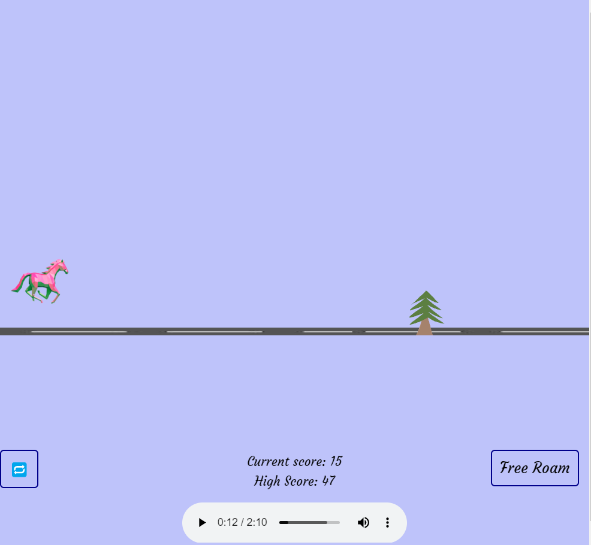

# The Horse-Tree Game
~ By Snehil Kumar

An Online Game, that is a clone of the Chrome-Dino game (the game that we play when internet gets disconnected).

The user plays the 'Horse', while the obstacles are the 'Trees'. Score increases with time. If the Horse is hit, the game ends. There is also a prize for the winner.

## Skills Used:
HTML, CSS, JS and p5.js javascript library.

## Game is Live😃:
https://snehil002.github.io/Horse-Tree/

## Bibliography:
Learned from **The Coding Train** youtube channel:
>https://www.youtube.com/user/shiffman

To play Chrome-Dino game, type this in the address bar of Google Chrome browser:
>chrome://dino